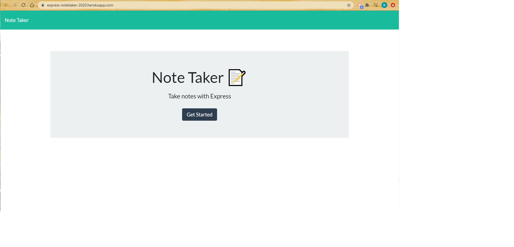
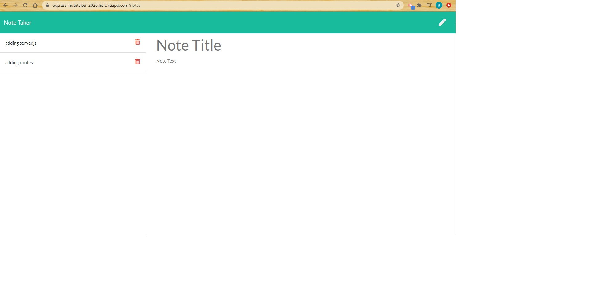

# Unit 11 Express Homework: Note Taker

The Application uses Node.js, Express.js and Heroku for deployment.

## Description

This application can be used to write, save, and delete notes. This application use an express backend to save and retrieve note data from a JSON file.

## User Story

AS A user, I want to be able to write and save notes

I WANT to be able to delete notes I've written before

SO THAT I can organize my thoughts and keep track of tasks I need to complete

## Business Context

For users that need to keep track of a lot of information, it's easy to forget or be unable to recall something important. Being able to take persistent notes allows users to have written information available when needed.

## Repository
- [Heroku App](https://express-notetaker-2020.herokuapp.com/)
- [Project Repo](https://github.com/beshayr2020/Note-Taker)
- [GitHub](https://beshayr2020.github.io/Note-Taker/)
